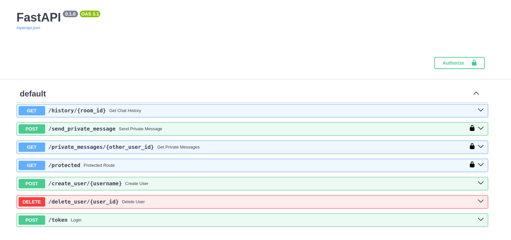

# Application de Chat en Temps Réel avec FastAPI et WebSockets

Une application de chat en temps réel construite avec **FastAPI** et **WebSockets**. Ce projet offre une base extensible pour créer des applications de messagerie avec **authentification**, **messagerie privée**, **traduction automatique**, et **gestion du registre linguistique**.



---

## Fonctionnalités

- **FastAPI** : Utilisation du framework FastAPI avec Python 3.10+ pour des performances optimales.
- **WebSockets** : Chat en temps réel avec mises à jour instantanées des messages.
- **Authentification Sécurisée** : Authentification des utilisateurs avec OAuth2PasswordBearer et JWT.
- **Messagerie Privée** : Possibilité d'envoyer et de recevoir des messages privés.
- **Base de Données** : Persistance des messages via **SQLite** (peut être remplacé par PostgreSQL).
- **Traduction Automatique** : Les messages sont traduits en temps réel avec **mBART** selon la langue et le registre de chaque utilisateur.
- **Personnalisation du Registre** : Adaptation du langage (familier, courant, soutenu).
- **Mise en Cache avec Redis** : Amélioration des performances grâce au stockage des traductions fréquentes.
- **Scalabilité** : Conçu pour être facilement extensible et personnalisable.

---

## Installation et Démarrage

### Prérequis

- **Python 3.10+**
- **Node.js** (pour le frontend)
- **Redis** (si utilisé pour la mise en cache)
- **Git**

### Installation

Clonez le projet et installez les dépendances :

```bash
git clone https://github.com/khfix/fastapi-chat-app.git
cd fastapi-chat-app
pip install -r requirements.txt
````

### Lancer l'application
Démarrez le serveur FastAPI avec :

```python
uvicorn app.main:app --reload
```

Ouvrez http://127.0.0.1:8000/docs dans votre navigateur pour explorer l'API via Swagger UI.